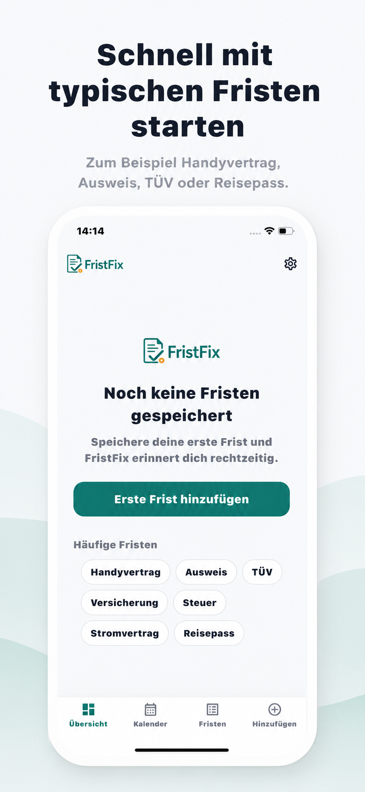
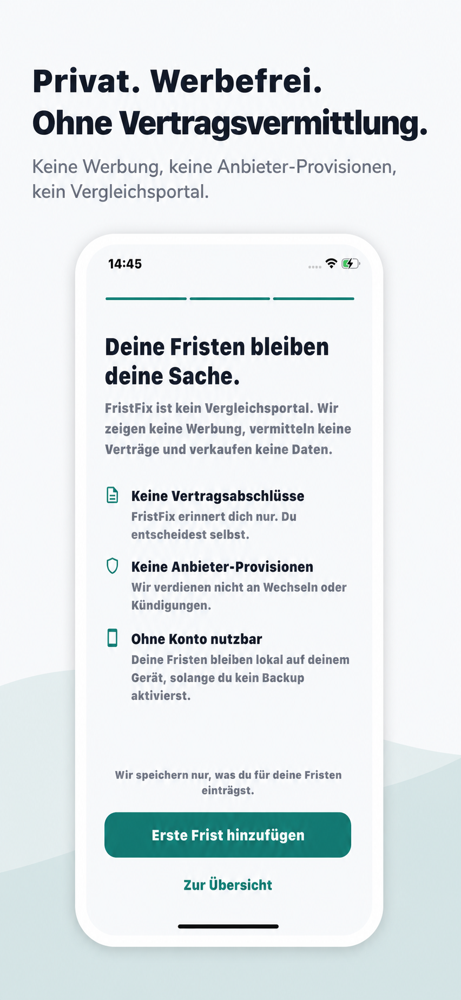
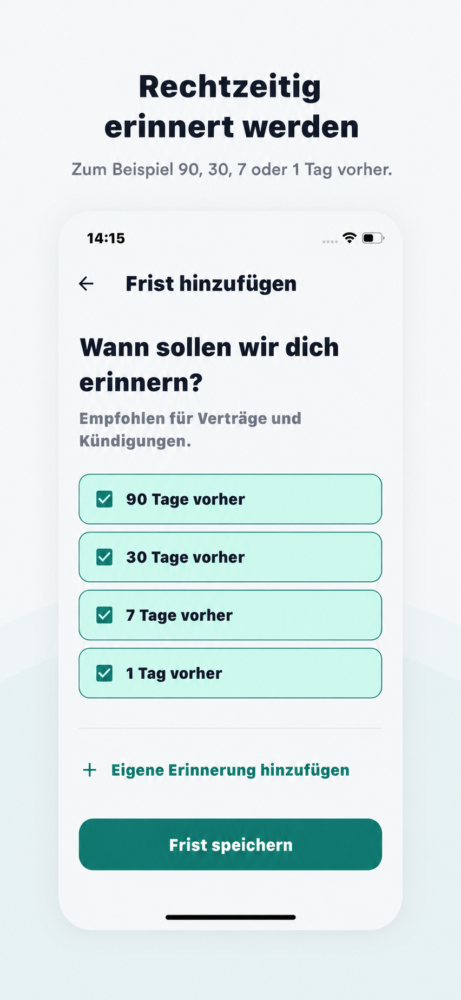
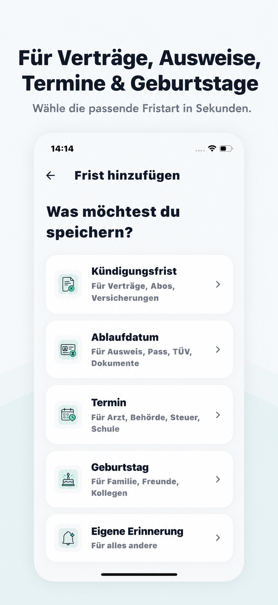
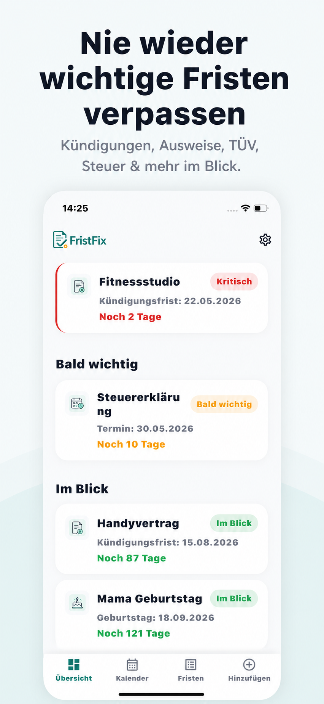

# FristFix

**Never miss an important deadline again.**

FristFix is a mobile app for tracking real-life deadlines — contract cancellation windows, ID/passport expiry, vehicle inspection (TÜV), insurance, tax dates, and personal reminders — and getting notified in time to act.

[](https://apps.apple.com/es/app/fristfix/id6769035165)
[](https://play.google.com/store/apps/details?id=de.fristfix.app)
[](https://www.fusionwebapps.com/apps/fristfix)

> Published and live on the Apple App Store and Google Play.

---

## About

Most people miss deadlines not because they don't care, but because the reminder never reaches them at the right moment. FristFix solves that with a simple, focused workflow: add a deadline once, and the app schedules a series of local notifications so you're reminded well ahead of time — three months out, a month out, a week out, and on the day itself.

The product is built around a few deliberate principles:

- **Ad-free** — no advertising, no data brokering, no contract-switching upsells.
- **Local-first** — your deadlines live on your device by default; the app is fully usable without an account.
- **Optional cloud** — sign in only if you want backup and multi-device sync.
- **Focused UX** — a clean, German-language interface with light and dark themes.

## Features

**Core (free)**
- Create deadlines with categories, types, provider, notes, and due dates
- Automatic reminder schedule (3 months / 1 month / 7 days before, plus the due date)
- Recurring deadlines (weekly, monthly, half-yearly, yearly, or custom intervals)
- Dashboard with status grouping (critical, soon, on the radar) and a month calendar view
- Dark mode
- Works fully offline and without an account (up to 5 active deadlines)

**Premium (€5.99/year)**
- Unlimited active deadlines
- Multiple reminders per deadline, including short-notice reminders (hours/minutes before)
- Cloud backup and cross-device sync
- Full calendar access

## Tech Stack

| Area | Technology |
|------|-----------|
| Framework / language | Flutter, Dart |
| State management | Provider (ChangeNotifier) |
| Local storage | Hive (primary store), SharedPreferences (settings) |
| Backend (optional) | Firebase Auth + Cloud Firestore |
| Authentication | Google, Apple, and email/password sign-in |
| In-app purchases | RevenueCat (purchases_flutter) |
| Notifications | flutter_local_notifications + timezone (on-device scheduling) |
| Background refresh | WorkManager (Android) |
| Calendar UI | table_calendar |

## Architecture

FristFix uses a layered, local-first architecture. The device is the source of truth; the cloud is an optional mirror.

```
lib/
├── main.dart            # Bootstraps Firebase, Hive, notifications; defers non-critical init
├── app.dart             # Provider wiring, theming, navigation shell
├── models/              # Domain models: Deadline, Reminder, Recurrence, categories, status
├── data/                # Repositories: local (Hive) + remote (Firestore) + Hive adapter
├── services/            # Auth, payments, sync, notifications, recurrence, background, storage
├── providers/           # App state (deadlines, subscription, theme) via ChangeNotifier
├── screens/             # Dashboard, calendar, deadlines, add/edit, premium, settings, onboarding
├── widgets/             # Reusable UI components
├── theme/               # Light/dark themes
└── utils/               # Helpers (e.g. free-tier limit logic)
```

**Data flow.** `DeadlineProvider` reads and writes through `LocalDeadlineRepository` (Hive) as the primary store. When a user is signed in and backup is enabled, `SyncService` mirrors changes to `RemoteDeadlineRepository` (Firestore). Sign-in triggers a merge of local and remote data with last-write-wins conflict resolution based on each deadline's `updatedAt` timestamp.

**Notifications.** Reminders are scheduled entirely on-device using `flutter_local_notifications` with timezone-aware scheduling — no push server is involved, which keeps the app private and functional offline. A dedicated `RecurrenceService` (pure business logic, no UI or storage dependencies) computes future occurrences and reminder dates. Recurring deadlines whose due date has passed are automatically advanced to their next occurrence when the app loads, and their notifications are rescheduled.

**Resilience.** Initialization of Firebase, Hive, and preferences is wrapped in timeouts and try/catch so the UI launches immediately even if a subsystem is slow or unavailable; the Hive layer degrades gracefully if a storage box can't be opened.

**Security.** Cloud data is namespaced per user (`users/{userId}/deadlines/{deadlineId}`) and protected by Firestore security rules that restrict every document to its authenticated owner.

## How It Was Built

FristFix was designed and shipped by Philipp Schaefer using an AI-native workflow — building end to end in close collaboration with AI coding agents (Claude Code, Kiro) rather than hand-writing every line. The role here is that of the builder and decision-maker: defining the product, shaping the architecture, directing the agents, reviewing and integrating their output, debugging platform-specific issues, and handling the full release process to both app stores. The result is a real, published product taken from idea to live listing.

## Screenshots

<p align="center">
  
  
  
  
  
</p>

## Status & Roadmap

**Status:** Published and live on the [App Store](https://apps.apple.com/es/app/fristfix/id6769035165) and [Google Play](https://play.google.com/store/apps/details?id=de.fristfix.app).

**Possible next steps**
- Deep-linking from a tapped notification to the relevant deadline
- Additional languages beyond German
- Broader automated test coverage

## About the Author

Built by **Philipp Schaefer**, an AI-native builder who ships products end to end by working alongside AI coding agents. More work at [fusionwebapps.com](https://www.fusionwebapps.com/apps/fristfix).
